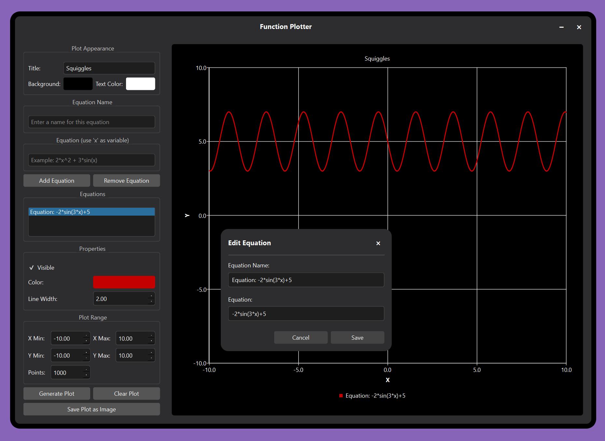

# Function Plotter

A simple Qt-based application for plotting mathematical functions with a customized/customizable interface.

## Features

- Plot multiple mathematical functions on the same graph
- Customizable plot appearance (background color, text color)
- Adjustable plot range and resolution
- Support for standard mathematical functions (sin, cos, sqrt, etc.)
- Save plots as images
- Modern UI with custom title bar and rounded corners

## Installation

### Windows
1. Download the latest release from the [Releases page](https://github.com/mrbrown24/FunctionPlotter/releases)
2. Extract the ZIP file to a location of your choice
3. Run `FunctionPlotter.exe`

### Building from Source
1. Clone this repository
2. Open `CMakeLists` in Qt Creator
3. Build and run the project

## Usage

1. Enter an equation in the "Equation" field using 'x' as the variable (e.g., 2\*x^2 + 3\*sin(x))
2. Enter a name for your equation
3. Click "Add Equation"
4. Adjust the plot range if needed
5. Click "Generate Plot"
6. To add more equations, repeat steps 1-4
7. To save the plot as an image, click "Save Plot as Image"

## Supported Functions

- Basic operations: +, -, *, /, ^
- Trigonometric: sin(x), cos(x), tan(x)
- Other: sqrt(x), abs(x), log(x), exp(x)
- Note: a dash for negative should be replaced with a -1*. In other words, don't type -sin(x), instead type -1*sin(x)

## License

This project is licensed under the MIT License - see the [LICENSE](LICENSE) file for details.
